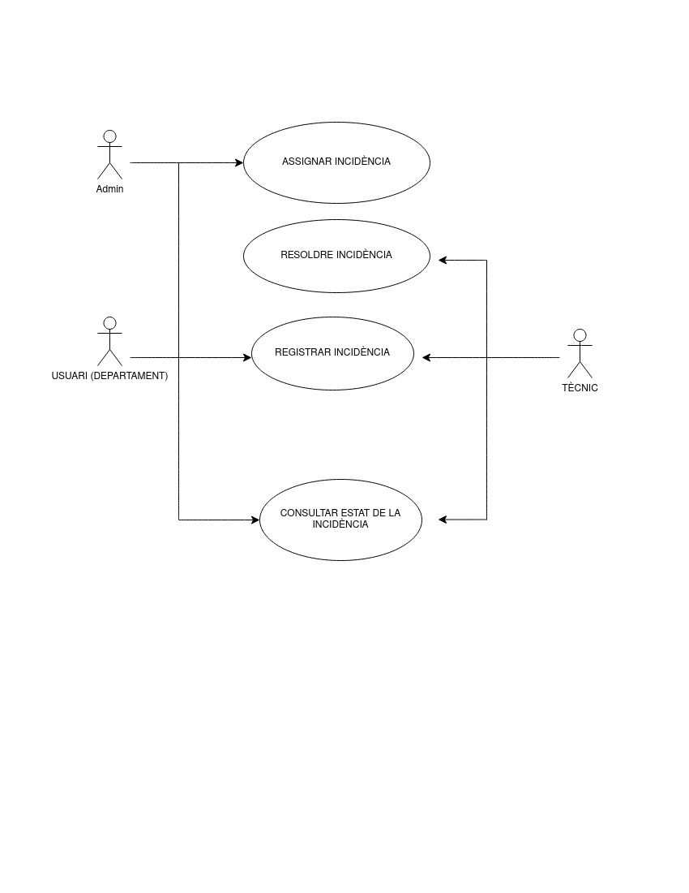

# Gestor d'Incidències Informàtiques

Aquest projecte és un sistema de gestió d'incidències informàtiques creat en PHP, amb connexió a un servidor MySQL. Permet als usuaris obrir incidències informàtiques, que seran assignades i gestionades pels tècnics de l'empresa. També permet visualitzar l'estat de les incidències, registrar actuacions i obtenir informes detallats sobre les incidències, els tècnics i els departaments.

## Descripció del projecte

Abans de tot, hem preparat el diagrama de cas d'us:



L'aplicació permet registrar i gestionar incidències informàtiques, amb les següents funcionalitats:

1. **Registrar nova incidència**: Els usuaris poden registrar noves incidències amb el seu departament, la data i una breu descripció del problema.
2. **Estat de la incidència**: Permet consultar l'estat d'una incidència mitjançant el codi d'incidència, mostrant les actuacions visibles per l'usuari.
3. **Modificar incidència**: El responsable d'informàtica pot assignar tècnics a les incidències no resoltes i establir la prioritat.
4. **Registrar actuació**: Els tècnics poden registrar actuacions a les incidències, amb la seva descripció, temps invertit i si la descripció és visible per l'usuari.
5. **Informe de tècnics**: Es mostra un informe amb les incidències no resoltes per cada tècnic, agrupades per prioritat, amb el temps dedicat fins al moment.
6. **Consum per departaments**: Informe de consum per departament, mostrant el nombre d'incidències reportades i el temps total dedicat a cada una.
7. **Estadístiques d'accés**: Panell estadístic de l'aplicació que mostra els accessos totals, les pàgines més visitades i els usuaris més actius, amb la possibilitat de filtrar per data, usuari i pàgina.

## Requisits

- **PHP**: Versió 7.4 o superior
- **MySQL**: Base de dades per emmagatzemar les incidències i les actuacions
- **Adminer**: Eina per gestionar la base de dades a través de la interfície web
- **Docker** (opcional): Per executar el projecte en un entorn de contenidors mitjançant Docker Compose

## Funcionalitats

### 1. Registrar nova incidència

Els usuaris poden registrar noves incidències indicant el seu departament, la data (automàtica) i una descripció curta del problema. El sistema generarà automàticament l'ID de la incidència.

### 2. Consultar l'estat d'una incidència

Els usuaris poden introduir el codi d'una incidència per veure'n l'estat i les actuacions registrades (només les visibles per l'usuari).

### 3. Modificar incidència

El responsable d'informàtica pot assignar tècnics i establir la prioritat de les incidències no resoltes.

### 4. Registrar actuació

Els tècnics poden registrar actuacions a les incidències, indicant el temps invertit i si la descripció és visible per l'usuari. També poden marcar la incidència com a resolta.

### 5. Informe de tècnics

Els tècnics poden veure un informe amb les incidències no resoltes, agrupades per prioritat i mostrant el temps dedicat a cada incidència.

### 6. Consum per departaments

Els responsables poden veure el nombre d'incidències reportades per cada departament i el temps total dedicat a la resolució de les mateixes.

### 7. Estadístiques d'accés

L'aplicació permet visualitzar estadístiques detallades sobre els accessos, les pàgines més visitades i els usuaris més actius, amb la possibilitat de filtrar per data, usuari i pàgina.

## Tecnologies utilitzades

- **PHP**: Per a la lògica de servidor.
- **MySQL**: Base de dades per emmagatzemar incidències i actuacions.
- **Docker**: Per executar l'aplicació en un entorn aïllat amb Docker Compose.
- **Adminer**: Eina per gestionar la base de dades a través de la interfície web.
- **Bootstrap**: Per a dissenyar una interfície responsive i visualment atractiva.
- **Penpot**: Disseny de prototips i fluxos de l'aplicació. -> https://design.penpot.app/#/view?file-id=c13b245b-18ea-8002-8007-ef6735605de1&page-id=c13b245b-18ea-8002-8007-ef6735605de2&section=interactions&index=0&share-id=6563c06e-a669-801f-8007-f93addb355f2

## Instal·lació

### Requisits previs

1. Tenir **PHP 7.4 o superior** instal·lat al teu ordinador.
2. Tenir **Docker** i **Docker Compose** instal·lats si vols executar l'aplicació en un entorn de contenidors.

### 1. Instal·lació amb Docker

Per executar l'aplicació en un contenidor Docker, simplement executa el següent comandament:

```
docker compose up
```